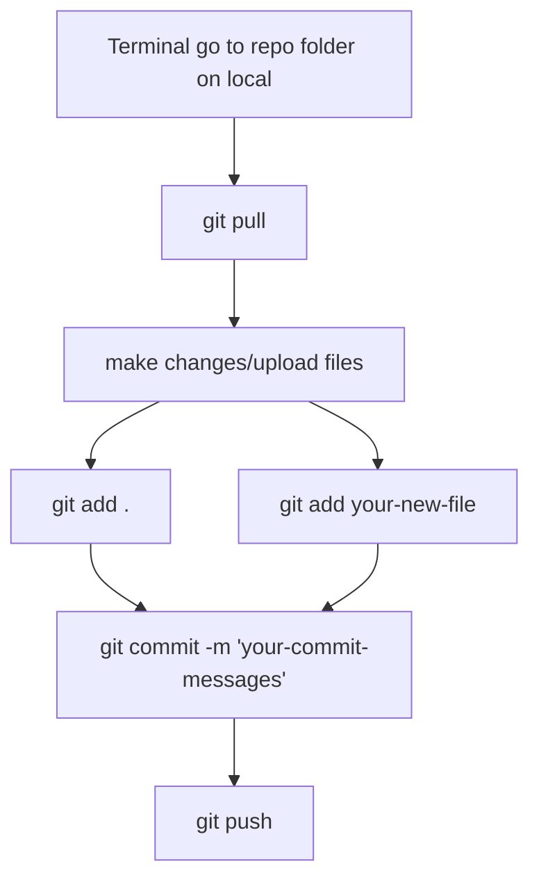

# Latest Week Summary (Week 2):
Week # 5 Date: 09/23/23 - 09/29/23

  

Aerodynamics Team

Due milestones:

-   First team meeting and divide parts for each member.
    

Completed milestones:

-   The first team meeting was held on 09/25/23.
    


Costs: $0

Upcoming milestones:

-   Make a trade matrix for each component by October 15
    
-   Finish Preliminary Model by Nov 1st
    

Additional Comments:

  

Structures Team (Wed)

Due milestones:

-   First team meeting and general schedule discussion
    

Completed milestones:

-   First team meeting 09//27/23 manual given to team members for machines.
    

Cost: $0

Upcoming milestones:

-   Learn the program for structures machines for next week's practice for laser and foam cutting.
    

Additional Comments:

  
  
  
  
  

Structures Team (Fri)

Due milestones:

-   Members attending the first meeting.
    
-   First team meeting and general schedule discussion
    

Completed milestones:

-   Members have been introduced to each other and assigned tasks such as wing trade studies.
    

Cost: $0

Upcoming milestones:

-   Members are looking to go through the Innovation Idea Labs training, analysis of wing geometry, and begin trade studies.
    
-   October 31st: First Report
    
-   November 2nd - Lockheed Martin Presentation
    

Additional Comments: N/A

  
  
  
  

Payload Team

Due milestones:

-   First team meeting and general schedule discussion
    

  

Completed milestones:

-   First team meeting and general schedule discussion
    

Cost: $0

Upcoming milestones:

-   Familiarize team members with Solidworks
    
-   Draft Top and Side Views with Dimensions and Fully Assembled
    
-   Brainstorm Latching System for Crew and Passenger Doors
    
-   Brainstorm method to secure EMT’s, Patient, and Medical Cabinet
    
-   Brainstorm  method to assemble payload into floor inserts for ground mission in 5 minutes
    
-   End of October: First Mock Up
    
-   November 15th -20th: First Physical Model
    
-   Mid-November: Propulsion Trade Studies
    

  
  
  
  

-   Mid-November: Test Propulsion Systems
    
-   End of January: Final Payload Assembly connect w/ Fuselage
    

  

Additional Comments: Focus on either Mission 2 or 3

  

Systems Team

Due milestones:

-   First team meeting, proposal format
    
-   schedule discussion,
    
-   join another sub-team meeting and join GitHub.
    

Completed milestones:

-   The first meeting was done on 09/25/23,
    
-   The proposal format was ready and shared,
    
-   all members joined GitHub.
    
-   Last year's comments for the proposal were read and shared.
    
-   Top 3 reports and proposals shared.
    

Cost: $0

Upcoming milestones:

-   Friday 09/29/23 write proposal parts 2.0 management summary, 2.3 schedules, 3.1 mission requirements, and 3.2 scoring sensitivity.
    
-   Due October 6th continue working on the proposal with new information of each sub-team.
    

Additional Comments:


Due October 6th continue working on the proposal with new information of each sub-team.
Additional Comments:| Subteam | Total | Spendings (This week) | Remaining |
| --- | --- | --- | --- |
| Aerodynamics Team | $2000 | $0 | $2000 |
| Structures Team (Wed) | $2000 | $0 | $2000 |
| Structures Team (Fri) | $2000 | $0 | $2000 |
| Payload Team | $8000 | $0 | $8000 |
| Systems Team | $2000 | $0 | $2000 |

# CPP DBF 23 - 24

  

This repository is dedicated to efficiently managing Computer-Aided Design (CAD) files, Gantt charts and general file storage for your project.

  

## Table of Contents

  

1. [Getting Started](#getting-started)

- [Prerequisites](#prerequisites)

- [Cloning the Repository](#cloning-the-repository)

2. [Uploading](#uploading)

 - [Pushing Changes to GitHub](#pushing-changes-to-github)

 - [Pulling Updates from GitHub](#pulling-updates-from-github)
  
  

## Getting Started

  Here's a flowchart


### Prerequisites

  

Before you begin using this GitHub repository, please ensure that you have the following:

  

- A GitHub account: If you don't have one yet, you can [sign up here](https://github.com/join).

- Git installed on your local machine. You can download it from [here](https://git-scm.com/downloads).

  

### Cloning the Repository

  

To get started, you'll need to clone the repository to your local machine. Open your terminal or Git Bash and use the following command:

  

```bash

git  clone  https://github.com/adevine2147/CPPDBF23-24.git
```
  

## Uploading

  

1.  **Uploading  Files**:

-  To  upload  files  to  your  repository,  click  the  "Add file"  button,  and  then  select  "Upload files"  from  the  dropdown.

-  Drag  and  drop  your  files  into  the  file  upload  area,  or  click  the  "choose your files"  link  to  browse  and  select  files  from  your  local  machine.

-  You  can  add  multiple  files  at  once.

  

2.  **Commit  Changes**:

-  After  selecting  your  files,  scroll  down  and  provide  a  brief  description  of  the  changes  you're making in the "Commit changes" section.

- Optionally, you can provide a longer description in the "Extended description" field.

  

3. **Commit New Files**:

- Click the "Commit changes" button to add your files to the repository.

  

## Pushing Changes to GitHub

  

1. **Make Local Changes**:

- Before pushing changes, you need to make changes to the files on your local machine. You can edit, add, or delete files as needed.

  

2. **Stage Changes**:

- In your terminal or Git client, use the following command to stage your changes:

```bash

git add .

```

-  This  command  stages  all  changes  for  commit.

```bash

git add {filename}

```

-  This  command  stages  specific  files  for  commit.

  
  

3.  **Commit  Changes**:

-  Commit  your  changes  with  a  descriptive  message  using  this  command:

```bash

git commit -m "Your commit message here"

```

  

4.  **Push  Changes  to  GitHub**:

-  To  push  your  local  changes  to  the  GitHub  repository,  use  the  following  command:

```bash

git push

```

## Pulling Updates from GitHub

  

1.  **Fetch  Remote  Changes**:

-  To  update  your  local  repository  with  changes  from  the  remote  repository (GitHub), use the following command:

```bash

git fetch origin

git pull

```

That's it! You've  successfully  learned  how  to  upload  files,  push  changes,  and  pull  updates  in  GitHub!

Latest Week Summary (Week 2):
this is week 2 test