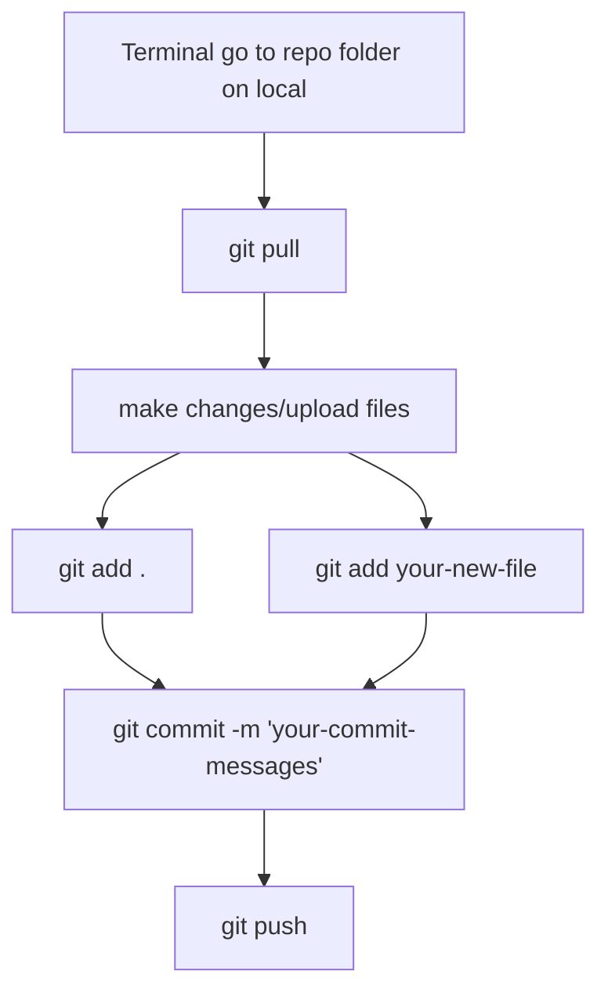

# Latest Week Summary (Week 6):
Week # 6     Date: 09/30/23    -    10/06/23

# Aerodynamics Team
### Due milestones: 
Meeting 10/02/2023 Trade matrix updates and progress check-in.
### Completed milestones: 
Most components finished 80% completed Airfoil NACA estimated: 64-ish.
### Cost: $0
### Upcoming milestones: 
Complete trade matrix and share to the Structures team and start CAD. 
***Additional Comments: ***
Got to contact people who did not make it to the meeting and share updates for the structures team.

# Structures Team (Wed)
### Due milestones: 
Learn the program for structures machines for next week's practice for laser and foam cutting.
### Completed milestones: 
 Had the team gather two airfoils: NACA 0012 & NACA 4412 from the NACA Airfoil Website and convert it into a SVG file to be edited in Inkscape. This allowed it to be compatible with the Hotwire Foam Cutter (HWFC) and allowed for the creation of a hole for the wing spar. 
It was then exported as a .DXF file into Vector Tracer which allowed it to create the basic command for the airfoil. Then finally exported as a tap file which was the file type that the HWFC (via MACH 4) would read in order to correctly cut out the airfoil. 
A dry run was first done in order to correctly verify if the HWFC was functioning correctly. The material used for the cutting was a pink insulation foam with 2 in of thickness in order to cut both airfoil shapes with a 2.5 ft span. This was done at 25 PSI.
### Cost: $109.46 
(total cost = [$49.98 * 2] + Tax) ( For the Styrofoam used)
### Upcoming milestones: 
The Wednesday team will study vacuum bagging techniques, resin safety, and handling safety for laminated materials such as: carbon fiber and fiberglass.
***Additional Comments: N/A***


# Structures Team (Fri)
### Due milestones: 
Members are looking to go through the Innovation Idea Labs training, analysis of wing geometry, and begin trade studies.
### Completed milestones: 
Arrival at the Innovation Idea Labs (IIL) in order to use the Laguna Laser CNC to cut out an 18 in Cord airfoil following the NACA 0012 & 4412 patterns. If there is time, then the team will practice putting Mylar (also known as BoPET) on existing wings in the lab.
### Cost: $85.97 
(2'x4'x1/4" plywood sheets 2BC 1Birch)
### Upcoming milestones: 
Make 12 in versions of both airfoils, due next Friday. Possibly also preparing for cutting 3.16 in balsa wood.
***Additional Comments: N/A***

# Payload Team
### Due milestones: 
Updates on payload bay design drafts.

### Completed milestones:
Team getting familiar with Solidworks and beginning a rough design of the dimensions of the payload bay for Structures/Manufacturing.
### Cost: $0
### Upcoming milestones:
Finish payload bay design by Friday (10/13/2023) with a top, side, and frontal view of payload dimensions. Also begin brainstorming a latching method to access the payload.
***Additional Comments: ***
Structures/Manufacturing and Payload are still waiting on Aero for dimensions of the fuselage.


Systems Team
Due milestones: 
Finish sections 1.0, 2.0, and 3.0 for the proposal, and start section 4.0.
Completed milestones: 
Finish section 1.0 and partial of 3.0 for the proposal


Cost: $0
Upcoming milestones: 
Finish the Gantt Chart and start updating with Structures for the manufacturing plan on proposal 4.0, section 3.0, and Section 2.0 from the PM by October 11th
Additional Comments:

# Budget
| Subteam | Total | Spendings (This week) | Remaining |
| --- | --- | --- | --- |
| Aerodynamics Team | $2000 | $0 | $2000 |
| Structures Team (Wed) | $2000 | $0 | $2000 |
| Structures Team (Fri) | $2000 | $0 | $2000 |
| Payload Team | $8000 | $0 | $8000 |
| Systems(Traveling) Team | $2000 | $0 | $2000 |

# CPP DBF 23 - 24

  

This repository is dedicated to efficiently managing Computer-Aided Design (CAD) files, Gantt charts and general file storage for your project.

  

## Table of Contents

  

1. [Getting Started](#getting-started)

- [Prerequisites](#prerequisites)

- [Cloning the Repository](#cloning-the-repository)

2. [Uploading](#uploading)

 - [Pushing Changes to GitHub](#pushing-changes-to-github)

 - [Pulling Updates from GitHub](#pulling-updates-from-github)
  
  

## Getting Started

  Here's a flowchart


### Prerequisites

  

Before you begin using this GitHub repository, please ensure that you have the following:

  

- A GitHub account: If you don't have one yet, you can [sign up here](https://github.com/join).

- Git installed on your local machine. You can download it from [here](https://git-scm.com/downloads).

  

### Cloning the Repository

  

To get started, you'll need to clone the repository to your local machine. Open your terminal or Git Bash and use the following command:

  

```bash

git  clone  https://github.com/adevine2147/CPPDBF23-24.git
```
  

## Uploading

  

1.  **Uploading  Files**:

-  To  upload  files  to  your  repository,  click  the  "Add file"  button,  and  then  select  "Upload files"  from  the  dropdown.

-  Drag  and  drop  your  files  into  the  file  upload  area,  or  click  the  "choose your files"  link  to  browse  and  select  files  from  your  local  machine.

-  You  can  add  multiple  files  at  once.

  

2.  **Commit  Changes**:

-  After  selecting  your  files,  scroll  down  and  provide  a  brief  description  of  the  changes  you're making in the "Commit changes" section.

- Optionally, you can provide a longer description in the "Extended description" field.

  

3. **Commit New Files**:

- Click the "Commit changes" button to add your files to the repository.

  

## Pushing Changes to GitHub

  

1. **Make Local Changes**:

- Before pushing changes, you need to make changes to the files on your local machine. You can edit, add, or delete files as needed.

  

2. **Stage Changes**:

- In your terminal or Git client, use the following command to stage your changes:

```bash

git add .

```

-  This  command  stages  all  changes  for  commit.

```bash

git add {filename}

```

-  This  command  stages  specific  files  for  commit.

  
  

3.  **Commit  Changes**:

-  Commit  your  changes  with  a  descriptive  message  using  this  command:

```bash

git commit -m "Your commit message here"

```

  

4.  **Push  Changes  to  GitHub**:

-  To  push  your  local  changes  to  the  GitHub  repository,  use  the  following  command:

```bash

git push

```

## Pulling Updates from GitHub

  

1.  **Fetch  Remote  Changes**:

-  To  update  your  local  repository  with  changes  from  the  remote  repository (GitHub), use the following command:

```bash

git fetch origin

git pull

```

That's it! You've  successfully  learned  how  to  upload  files,  push  changes,  and  pull  updates  in  GitHub!

Latest Week Summary (Week 2):
this is week 2 test